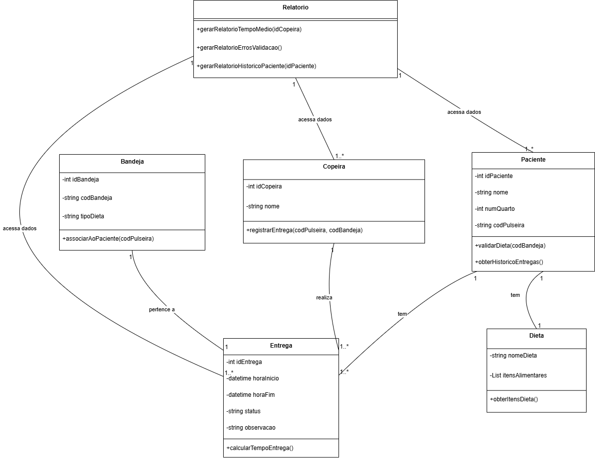
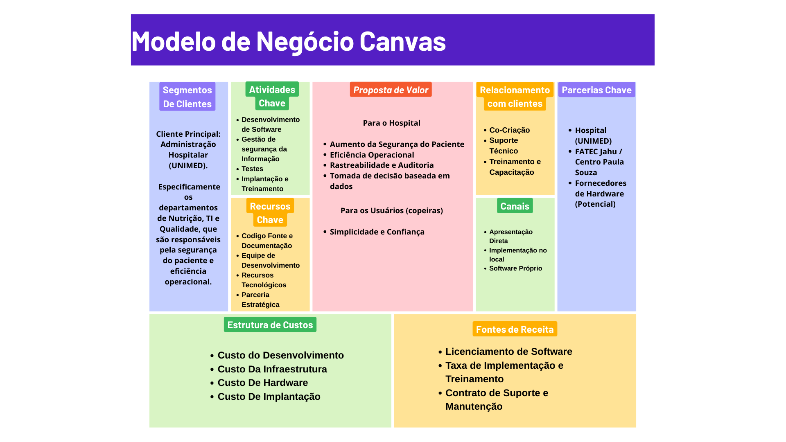
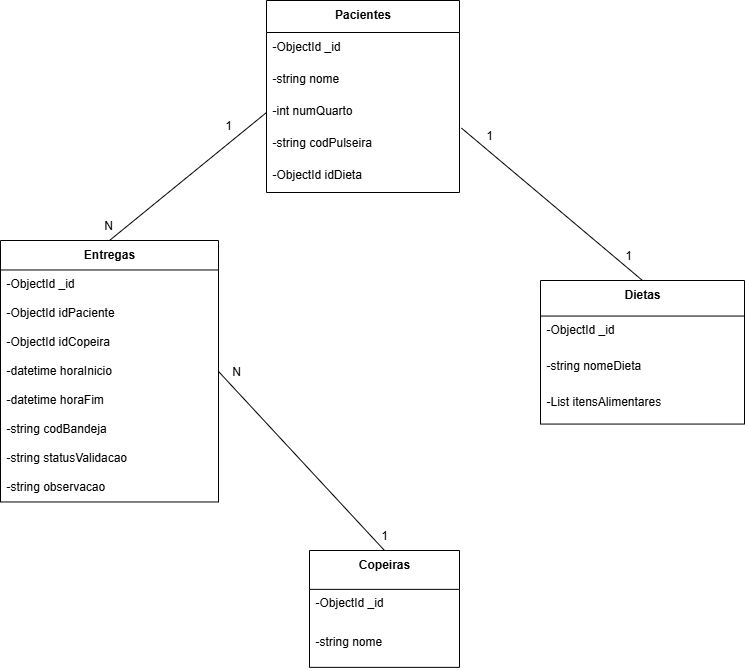

# CENTRO PAULA SOUZA

## FACULDADE DE TECNOLOGIA DE JAHU

### CURSO DE TECNOLOGIA EM DESENVOLVIMENTO DE SOFTWARE MULTIPLATAFORMA

---

## **DOCUMENTAÇÃO DO PROJETO INTERDISCIPLINAR (PI)**

## **Controle de Dieta Hospitalar**

### _Sistema de monitoramento e validação de entregas de refeições hospitalares (Protótipo UNIMED)_

**Jahu - SP**
**2º semestre/2025**

**Autores:**

- Luis Felipe Veronezi Bernado
- Leonardo Antoniassi
- Pedro Henrique do Vale Mineo
- Bruno Ferraz Waldrigui

---

### **1. Descrição do Projeto**

#### **1.1. Introdução**

Este projeto tem como objetivo desenvolver um protótipo funcional para o monitoramento e validação da entrega de refeições no ambiente hospitalar. Atualmente, a ausência de um sistema para registrar e validar este processo pode levar a falhas operacionais, como atrasos, extravios de bandejas ou a entrega incorreta de dietas a pacientes.

A solução proposta utiliza tecnologia para garantir a segurança alimentar, o controle operacional e o rastreamento eficiente das refeições, desde a preparação até a entrega final ao paciente.

#### **1.2. Tecnologias e Ferramentas**

Para o desenvolvimento deste projeto, serão utilizadas as seguintes tecnologias e ferramentas:

- **Linguagens de Programação:** `C#`, `HTML`, `CSS`
- **Frameworks:** `[A definir]`
- **Banco de Dados:** `MongoDB`
- **Controle de Versão:** `Git` e `GitHub`
- **Planejamento:** `Trello`
- **Prototipagem:** `[A definir]`
- **Modelo de Processo de Desenvolvimento (Scrum):** Para o desenvolvimento deste projeto, foi adotada a metodologia ágil Scrum. Esta abordagem foi escolhida por sua capacidade de lidar com a complexidade e a incerteza inerentes ao desenvolvimento de um novo sistema, permitindo que o time se adapte rapidamente a mudanças e imprevistos.

#### **1.3. Cronograma**

A plataforma `Trello` foi utilizada como ferramenta de gerenciamento de tarefas para garantir a organização e a transparência do projeto. O Trello permite visualizar o fluxo de trabalho de forma clara e intuitiva, servindo como nosso "quadro Scrum" digital.

- **Link do Trello:** [Quadro de Planejamento do PI](https://trello.com/invite/b/67d96ee6c4eec72235cd27a7/ATTIcc8c394bb422c889d3f6de5c965a6044FC681C1A/pi)

---

### **2. Objetivos**

#### **2.1. Geral**

Desenvolver um protótipo funcional para monitorar e validar o processo de entrega de refeições hospitalares, garantindo a segurança do paciente e a eficiência operacional.

#### **2.2. Específicos**

- Monitorar o tempo de entrega das refeições (início e fim).
- Registrar qual copeira realizou a entrega.
- Validar se a bandeja corresponde ao paciente certo, utilizando códigos de barras.
- Gerar relatórios simples (ex: tempo médio de entrega, erros de validação, histórico por paciente).
- Estar preparado para futura integração com o prontuário eletrônico.

---

### **3. Documento de Requisitos**

#### **3.1. Histórias de Usuário**

**-- Histórias de Usuário da Copeira --**

- **HU1: Iniciar uma rodada de entregas** (Relacionado a RF2, RF3, RF4)

  > Como uma **copeira**, eu quero **me logar no sistema no início do meu turno** para que **todas as entregas que eu realizar sejam registradas em meu nome**.

- **HU2: Validar a entrega de uma refeição** (Relacionado a RF1, RF3, RF4, RF5)

  > Como uma **copeira**, eu quero **escanear o código de barras da pulseira do paciente e depois o da bandeja** para que **o sistema confirme automaticamente se a refeição está correta para aquele paciente, garantindo sua segurança**.

- **HU3: Ser alertada sobre um erro de entrega** (Relacionado a RF6)

  > Como uma **copeira**, eu quero **receber um alerta sonoro e visual bem claro (ex: tela vermelha)** para que **eu saiba imediatamente que a bandeja não pertence ao paciente e possa corrigir o erro na hora**.

- **HU4: Finalizar uma entrega** (Relacionado a RF1 - conclusão da entrega)
  > Como uma **copeira**, eu quero **marcar a entrega como "concluída" no sistema após deixar a bandeja com o paciente** para que **o horário exato do fim da entrega seja registrado**.

**-- Histórias de Usuário do Gestor de Nutrição --**

- **HU5: Analisar a eficiência da equipe** (Relacionado a RF7)

  > Como um **gestor de nutrição**, eu quero **gerar um relatório com o tempo médio de entrega das refeições** para que **eu possa avaliar a eficiência da operação e otimizar os processos**.

- **HU6: Monitorar a segurança do paciente** (Relacionado a RF8)

  > Como um **gestor de nutrição**, eu quero **gerar um relatório de todos os erros de validação (bandeja vs. paciente)** para que **eu possa investigar as causas, identificar padrões e aplicar treinamentos para aumentar a segurança**.

- **HU7: Auditar as entregas de um paciente** (Relacionado a RF9)
  > Como um **gestor de nutrição**, eu quero **consultar o histórico completo de refeições entregues a um paciente específico** para que **eu possa auditar o serviço, verificar a adesão à dieta e ter rastreabilidade total do processo**.

#### **3.2. Requisitos Funcionais**

Estes são os requisitos que o sistema deve cumprir para atender às necessidades do hospital:

- **RF1:** O sistema deve registrar o horário de início e fim da entrega.
- **RF2:** O sistema deve registrar a copeira responsável pela entrega.
- **RF3:** O sistema deve ler o código de barras da pulseira do paciente.
- **RF4:** O sistema deve ler o código de barras da etiqueta da bandeja.
- **RF5:** O sistema deve validar, de forma automatizada, a correspondência entre o código do paciente e o código da bandeja.
- **RF6:** O sistema deve emitir um aviso sonoro/visual em caso de validação incorreta.
- **RF7:** O sistema deve gerar relatórios com o tempo médio de entrega.
- **RF8:** O sistema deve gerar relatórios de erros de validação.
- **RF9:** O sistema deve manter um histórico de entregas por paciente.
- **RF10:** O sistema deve permitir cadastrar Paciente.
- **RF11:** O sistema deve permitir cadastrar Dieta.
- **RF12:** O sistema deve permitir cadastrar Copeira.

#### **3.3. Requisitos Não Funcionais**

Estes são os requisitos de qualidade do sistema:

- **RNF1 - Usabilidade:** A interface deve ser simples, intuitiva e fácil de usar para as copeiras.
- **RNF2 - Confiabilidade:** O sistema deve ser confiável e ter alta disponibilidade para evitar falhas durante o processo de entrega.
- **RNF3 - Desempenho:** O tempo de validação e registro deve ser rápido para não atrasar a entrega.
- **RNF4 - Segurança:** O sistema deve garantir a privacidade dos dados do paciente.
- **RNF5 - Manutenibilidade:** O código deve ser bem documentado para facilitar futuras manutenções e evoluções.

#### **3.4. Diagrama de Casos de Uso**

## **CASOS DE USO DE ALTO NÍVEL**

- **Caso de Uso: Cadastrar nova dieta**

> O usuário poderá cadastrar uma nova dieta. Quando cadastrada poderá ser exibida e relacionada ao paciente.

- **Caso de Uso: Cadastrar copeira**

> O usuário poderá cadastrar uma nova copeira no sistema, que será responsável pelas entregas das refeições.

- **Caso de Uso: Ler código de barras**

> O usuário poderá escanear os códigos de barras da pulseira do paciente e da bandeja de refeição para garantir a entrega correta.

- **Caso de Uso: Ver relatórios**

> O usuário poderá visualizar relatórios gerados pelo sistema sobre o tempo de entrega, erros de validação e outros dados relevantes.

- **Caso de Uso: Cadastrar novo paciente**

> O usuário poderá cadastrar um novo paciente. Quando cadastrado poderá ser exibido e relacionado a copeira.

- **Caso de Uso: Inserir dados para relatório**

> O usuário poderá inserir os dados de cada entrega realizada (como horários de início e fim, códigos de barras escaneados, etc.) para geração de relatórios.

#### **3.5. Diagrama de Classes**
O Diagrama de Classes é um componente essencial na arquitetura do nosso sistema, servindo como uma representação visual da estrutura e do design de banco de dados do projeto. Ele detalha as principais entidades, como Pacientes, Copeiras, Entregas e Dietas, e ilustra como elas se relacionam para garantir o fluxo de informações e as funcionalidades do sistema.

Este diagrama foi concebido com base nos requisitos do projeto e na natureza do banco de dados NoSQL (MongoDB), proporcionando uma visão clara de como os dados serão organizados, persistidos e acessados pela aplicação.

## **Relacionamento entre as Classes**
O diagrama de classes não apenas representa as entidades do sistema, mas também ilustra como elas se conectam e interagem. A natureza de cada relacionamento é definida pela sua cardinalidade e pelo tipo de associação, que neste projeto são:

> Agregação: Representa uma relação de "todo-parte" onde as partes (Entregas) podem existir independentemente do todo (Pacientes ou Copeiras). É uma relação mais fraca de dependência.

> Associação: Uma relação simples que indica que as classes se comunicam entre si. Não há uma dependência de ciclo de vida, ou seja, uma classe pode existir sem a outra.

Com base nisso, os relacionamentos no nosso projeto são:

> Pacientes e Entregas (Agregação): Um Paciente pode ter várias Entregas ao longo do tempo. As entregas, por sua vez, estão vinculadas a um único paciente. Mesmo se o paciente for removido, o registro das entregas permanece para fins de histórico e relatórios.

> Copeiras e Entregas (Agregação): Uma Copeira realiza várias Entregas. Assim como no caso anterior, o registro da entrega é mantido mesmo se a copeira for removida.

> Pacientes e Dietas (Associação): Um Paciente tem uma Dieta prescrita. Essa é uma relação direta, mas a Dieta também existe de forma independente na sua própria classe e pode ser associada a outros pacientes.

> Relatórios e as demais classes (Associação): A classe Relatórios não é uma parte intrínseca das outras classes. Ela apenas as utiliza (associa-se a elas) para coletar e processar dados, a fim de gerar as informações necessárias para a gestão do sistema.

---

### **4. Estudo de Viabilidade**

#### **4.1 Viabilidade de Mercado**

O projeto de Sistema de Monitoramento de Entrega de Refeições Hospitalares demonstra uma clara viabilidade de mercado. O problema atual, que se baseia na validação manual da entrega de bandejas, é um ponto frágil que pode levar a erros graves e comprometer a segurança do paciente. O público-alvo, hospitais de médio e grande porte, apresenta uma demanda crescente por soluções que melhorem a eficiência operacional e a experiência do paciente. A principal vantagem competitiva do projeto é a sua inovação, pois não foram identificados concorrentes diretos no mercado que ofereçam uma solução similar. Isso posiciona o sistema como um diferencial, com grande potencial para ser adotado por instituições de saúde que buscam modernizar seus processos.

#### **4.2 Viabilidade de Recursos**

A viabilidade de recursos para o desenvolvimento do protótipo é alta, com baixo custo e acesso facilitado a todas as tecnologias necessárias.

Recursos Humanos: A equipe de desenvolvimento é composta por desenvolvedores C#, um designer de interface (UI/UX) para garantir um aplicativo intuitivo e um analista/testador para validar o sistema. Para a implementação, a própria equipe de desenvolvimento pode atuar no treinamento da equipe do hospital.

Recursos Tecnológicos: O projeto será desenvolvido em C# e usará MongoDB, ferramentas com versões gratuitas, o que minimiza o custo de software. Em termos de hardware, a solução utiliza celulares com câmera para a leitura de códigos de barras, evitando a necessidade de hardware caro e de difícil manutenção. Os únicos custos de hardware seriam com as impressoras de etiquetas e pulseiras.

Recursos Financeiros: O custo para o protótipo é considerado baixo. O maior investimento é o tempo de dedicação da equipe, já que as ferramentas de desenvolvimento são gratuitas e o hardware é de fácil acesso.

#### **4.3 Viabilidade Operacional**

A viabilidade operacional do projeto é comprovada por um fluxo de trabalho simples e eficiente que se integra facilmente às rotinas de hospitais. O sistema otimiza o processo de entrega de forma clara, garantindo rastreabilidade e segurança. O fluxo de trabalho proposto é:

A copeira escaneia o código de barras da etiqueta da bandeja com o aplicativo no celular.

O sistema registra o início da entrega e as informações da refeição.

A copeira, no quarto do paciente, escaneia a pulseira de identificação do paciente.

O sistema realiza a validação cruzada, confirmando que a bandeja e o paciente correspondem.

A entrega é registrada como finalizada, marcando o tempo gasto e o profissional responsável.

Esse processo simplificado não apenas reduz a chance de erros, mas também gera dados valiosos para a gestão de relatórios de eficiência.

#### **4.4 Conclusão do Estudo de Viabilidade**

Com base na análise completa, o projeto de Sistema de Monitoramento de Entrega de Refeições Hospitalares é altamente viável. Existe uma necessidade clara de mercado, a solução é inovadora e não enfrenta concorrência direta. Os recursos (humanos, tecnológicos e financeiros) para o desenvolvimento do protótipo estão disponíveis e são acessíveis. Operacionalmente, o sistema propõe um fluxo de trabalho simples e eficaz que resolve um problema real e crítico na rotina hospitalar.

---

### **5. Regras de Negócio**

As Regras de Negócio são as políticas, restrições e lógicas específicas que o sistema deve seguir para que o processo funcione de forma correta, segura e consistente, de acordo com as normas operacionais do hospital. Elas funcionam como as "leis" que governam as funcionalidades do sistema.

---

#### **RN1: Acesso e Autenticação**

- **RN1.1 - Acesso Restrito:** O acesso ao sistema só é permitido para usuários autenticados com login e senha válidos.
- **RN1.2 - Rastreabilidade de Ações:** Todas as ações de registro e validação devem ser obrigatoriamente vinculadas à copeira que está logada na sessão. O sistema não pode permitir uma entrega anônima.
- **RN1.3 - Perfis de Usuário:** O sistema deve possuir pelo menos dois níveis de acesso: **Copeira** (com permissão para registrar entregas) e **Gestor de Nutrição** (com permissão para gerar relatórios e visualizar dados consolidados).

#### **RN2: Processo de Entrega**

- **RN2.1 - Ciclo de Entrega:** Uma entrega é um ciclo que se inicia com o registro de "início da entrega" e termina com o registro de "entrega concluída". O sistema deve registrar ambos os horários.
- **RN2.2 - Proibição de Entrega sem Validação:** Uma entrega só pode ser marcada como "concluída" após uma validação bem-sucedida, conforme as regras da seção RN3.

#### **RN3: Validação e Segurança (Regras Críticas)**

- **RN3.1 - Validação Obrigatória:** Para validar uma entrega, é obrigatória a leitura bem-sucedida de dois códigos de barras: o da pulseira do paciente e o da etiqueta da bandeja.
- **RN3.2 - Critério de Sucesso:** A validação é considerada bem-sucedida _se, e somente se,_ o identificador do paciente lido na pulseira for idêntico ao identificador do paciente associado à bandeja no sistema.
- **RN3.3 - Bloqueio por Incompatibilidade:** Se a validação falhar (os identificadores não corresponderem), o sistema deve **bloquear** a continuação do processo. A copeira não poderá registrar a entrega como "concluída".
- **RN3.4 - Alerta Imediato:** Em caso de falha na validação, um alerta sonoro e visual deve ser disparado imediatamente para notificar a copeira do erro.
- **RN3.5 - Registro de Falha:** Toda falha de validação deve ser registrada no sistema para fins de auditoria e geração de relatórios.

#### **RN4: Dados e Relatórios**

- **RN4.1 - Cálculo do Tempo de Entrega:** O tempo de entrega, usado no relatório de tempo médio, deve ser calculado como a diferença (em minutos) entre o horário de "entrega concluída" e o de "início da entrega".
- **RN4.2 - Integridade do Histórico:** Nenhum registro de entrega (bem-sucedida ou falha) pode ser excluído do sistema por um usuário com perfil de "Copeira".
- **RN4.3 - Conteúdo do Relatório de Erros:** O relatório de erros de validação deve conter, no mínimo: a data e hora da ocorrência, o nome da copeira, o identificador do paciente e o identificador da bandeja envolvidos na falha.

### **6. Design (UI/UX)**

`[A ser desenvolvido]`

### **7. Banco de Dados**

O banco de dados do projeto foi arquitetado com base no MongoDB, uma tecnologia NoSQL. Diferentemente dos bancos de dados relacionais que utilizam tabelas e chaves estrangeiras, o MongoDB armazena dados em coleções de documentos, proporcionando maior flexibilidade e escalabilidade.

O diagrama abaixo ilustra a estrutura das nossas coleções, que servem como contêineres para os documentos do sistema. As relações entre as coleções são estabelecidas por meio de referências, onde o ID de um documento é armazenado em outro para criar as conexões lógicas.

> Pacientes: Coleção central que armazena os dados básicos dos pacientes, incluindo a referência para a dieta prescrita (idDieta).

> Dietas: Coleção responsável por manter a definição detalhada de cada dieta, permitindo que a aplicação em C# associe um paciente a uma dieta sem duplicar informações.

> Copeiras: Coleção que registra as informações de cada copeira, permitindo a rastreabilidade das entregas.

> Entregas: Coleção crucial que registra cada evento de entrega, contendo referências para o paciente (idPaciente) e a copeira (idCopeira) correspondentes.

### **8. Protótipo**

`[A ser desenvolvido]`

### **9. Aplicação**

`[A ser desenvolvido]`

### **10. Considerações Finais**

`[A ser desenvolvido]`

---

### **Referências Bibliográficas**

`[A ser inserido]`
