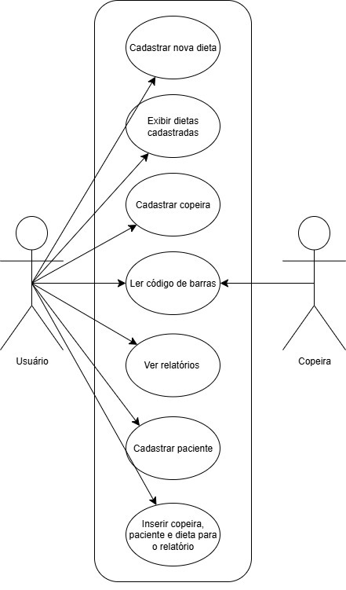

# CENTRO PAULA SOUZA
## FACULDADE DE TECNOLOGIA DE JAHU
### CURSO DE TECNOLOGIA EM DESENVOLVIMENTO DE SOFTWARE MULTIPLATAFORMA

---

## **DOCUMENTAÇÃO DO PROJETO INTERDISCIPLINAR (PI)**

## **Controle de Dieta Hospitalar**
### *Sistema de monitoramento e validação de entregas de refeições hospitalares (Protótipo UNIMED)*

**Jahu - SP**
**2º semestre/2025**

**Autores:**
- Luis Felipe Veronezi Bernado
- Leonardo Antoniassi
- Pedro Henrique do Vale Mineo
- Bruno Ferraz Waldrigui

---

### **1. Descrição do Projeto**

#### **1.1. Introdução**
Este projeto tem como objetivo desenvolver um protótipo funcional para o monitoramento e validação da entrega de refeições no ambiente hospitalar. Atualmente, a ausência de um sistema para registrar e validar este processo pode levar a falhas operacionais, como atrasos, extravios de bandejas ou a entrega incorreta de dietas a pacientes.

A solução proposta utiliza tecnologia para garantir a segurança alimentar, o controle operacional e o rastreamento eficiente das refeições, desde a preparação até a entrega final ao paciente.

#### **1.2. Tecnologias e Ferramentas**
Para o desenvolvimento deste projeto, serão utilizadas as seguintes tecnologias e ferramentas:

- **Linguagens de Programação:** `C#`, `HTML`, `CSS`
- **Frameworks:** `[A definir]`
- **Banco de Dados:** `MongoDB`
- **Controle de Versão:** `Git` e `GitHub`
- **Planejamento:** `Trello`
- **Prototipagem:** `[A definir]`
- **Modelo de Processo de Desenvolvimento (Scrum):** Para o desenvolvimento deste projeto, foi adotada a metodologia ágil Scrum. Esta abordagem foi escolhida por sua capacidade de lidar com a complexidade e a incerteza inerentes ao desenvolvimento de um novo sistema, permitindo que o time se adapte rapidamente a mudanças e imprevistos.

#### **1.3. Cronograma**
A plataforma `Trello` foi utilizada como ferramenta de gerenciamento de tarefas para garantir a organização e a transparência do projeto. O Trello permite visualizar o fluxo de trabalho de forma clara e intuitiva, servindo como nosso "quadro Scrum" digital.

- **Link do Trello:** [Quadro de Planejamento do PI](https://trello.com/invite/b/67d96ee6c4eec72235cd27a7/ATTIcc8c394bb422c889d3f6de5c965a6044FC681C1A/pi)

---

### **2. Objetivos**

#### **2.1. Geral**
Desenvolver um protótipo funcional para monitorar e validar o processo de entrega de refeições hospitalares, garantindo a segurança do paciente e a eficiência operacional.

#### **2.2. Específicos**
- Monitorar o tempo de entrega das refeições (início e fim).
- Registrar qual copeira realizou a entrega.
- Validar se a bandeja corresponde ao paciente certo, utilizando códigos de barras.
- Gerar relatórios simples (ex: tempo médio de entrega, erros de validação, histórico por paciente).
- Estar preparado para futura integração com o prontuário eletrônico.

---

### **3. Documento de Requisitos**

#### **3.1. Histórias de Usuário**

**-- Histórias de Usuário da Copeira --**

* **HU1: Iniciar uma rodada de entregas** (Relacionado a RF2, RF3, RF4)
    > Como uma **copeira**, eu quero **me logar no sistema no início do meu turno** para que **todas as entregas que eu realizar sejam registradas em meu nome**.

* **HU2: Validar a entrega de uma refeição** (Relacionado a RF1, RF3, RF4, RF5)
    > Como uma **copeira**, eu quero **escanear o código de barras da pulseira do paciente e depois o da bandeja** para que **o sistema confirme automaticamente se a refeição está correta para aquele paciente, garantindo sua segurança**.

* **HU3: Ser alertada sobre um erro de entrega** (Relacionado a RF6)
    > Como uma **copeira**, eu quero **receber um alerta sonoro e visual bem claro (ex: tela vermelha)** para que **eu saiba imediatamente que a bandeja não pertence ao paciente e possa corrigir o erro na hora**.

* **HU4: Finalizar uma entrega** (Relacionado a RF1 - conclusão da entrega)
    > Como uma **copeira**, eu quero **marcar a entrega como "concluída" no sistema após deixar a bandeja com o paciente** para que **o horário exato do fim da entrega seja registrado**.

**-- Histórias de Usuário do Gestor de Nutrição --**

* **HU5: Analisar a eficiência da equipe** (Relacionado a RF7)
    > Como um **gestor de nutrição**, eu quero **gerar um relatório com o tempo médio de entrega das refeições** para que **eu possa avaliar a eficiência da operação e otimizar os processos**.

* **HU6: Monitorar a segurança do paciente** (Relacionado a RF8)
    > Como um **gestor de nutrição**, eu quero **gerar um relatório de todos os erros de validação (bandeja vs. paciente)** para que **eu possa investigar as causas, identificar padrões e aplicar treinamentos para aumentar a segurança**.

* **HU7: Auditar as entregas de um paciente** (Relacionado a RF9)
    > Como um **gestor de nutrição**, eu quero **consultar o histórico completo de refeições entregues a um paciente específico** para que **eu possa auditar o serviço, verificar a adesão à dieta e ter rastreabilidade total do processo**.

#### **3.2. Requisitos Funcionais**
Estes são os requisitos que o sistema deve cumprir para atender às necessidades do hospital:

- **RF1:** O sistema deve registrar o horário de início e fim da entrega.
- **RF2:** O sistema deve registrar a copeira responsável pela entrega.
- **RF3:** O sistema deve ler o código de barras da pulseira do paciente.
- **RF4:** O sistema deve ler o código de barras da etiqueta da bandeja.
- **RF5:** O sistema deve validar, de forma automatizada, a correspondência entre o código do paciente e o código da bandeja.
- **RF6:** O sistema deve emitir um aviso sonoro/visual em caso de validação incorreta.
- **RF7:** O sistema deve gerar relatórios com o tempo médio de entrega.
- **RF8:** O sistema deve gerar relatórios de erros de validação.
- **RF9:** O sistema deve manter um histórico de entregas por paciente.

#### **3.3. Requisitos Não Funcionais**
Estes são os requisitos de qualidade do sistema:

- **RNF1 - Usabilidade:** A interface deve ser simples, intuitiva e fácil de usar para as copeiras.
- **RNF2 - Confiabilidade:** O sistema deve ser confiável e ter alta disponibilidade para evitar falhas durante o processo de entrega.
- **RNF3 - Desempenho:** O tempo de validação e registro deve ser rápido para não atrasar a entrega.
- **RNF4 - Segurança:** O sistema deve garantir a privacidade dos dados do paciente.
- **RNF5 - Manutenibilidade:** O código deve ser bem documentado para facilitar futuras manutenções e evoluções.

#### **3.4. Diagrama de Casos de Uso**

- `[Detalhado]`

#### **3.5. Diagrama de Classes**

---

### **4. Estudo de Viabilidade**
`[A ser desenvolvido]`

### **5. Regras de Negócio**
`[A ser desenvolvido]`

### **6. Design (UI/UX)**
`[A ser desenvolvido]`

### **7. Banco de Dados**
`[A ser desenvolvido]`

### **8. Protótipo**
`[A ser desenvolvido]`

### **9. Aplicação**
`[A ser desenvolvido]`

### **10. Considerações Finais**
`[A ser desenvolvido]`

---

### **Referências Bibliográficas**
`[A ser inserido]`